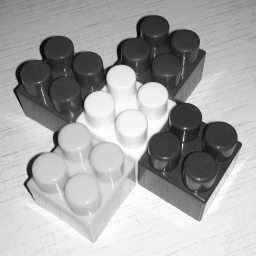

## Работа 3. Яркостные преобразования
автор: Плохотнюк А. Д.
дата: 2022-03-01T11:03:02

url: https://github.com/Gorgeousanya/ImageProcessing

### Задание
1. В качестве тестового использовать изображение data/cross_0256x0256.png
2. Сгенерировать нетривиальную новую функцию преобразования яркости (не стоит использовать слишком простые и слишком простые функции).
3. Сгенерировать визуализацию функцию преобразования яркости в виде изображения размером 512x512, черные точки а белом фоне.
4. Преобразовать пиксели grayscale версии тестового изображения при помощи LUT для сгенерированной функции преобразования.
4. Преобразовать пиксели каждого канала тестового изображения при помощи LUT для сгенерированной функции преобразования.
5. Результы сохранить для вставки в отчет.

### Результаты


Рис. 1. Исходное тестовое изображение


Рис. 2. Тестовое изображение greyscale


Рис. 3. Результат применения функции преобразования яркости для greyscale


Рис. 4. Результат применения функции преобразования яркости для каналов


Рис. 5. Визуализация функции яркостного преобразования

### Текст программы

```cpp
#include <opencv2/opencv.hpp>

int main() {
    cv::Mat img = cv::imread("..\\..\\..\\data\\cross_0256x0256.png");
    cv::imwrite("lab03_rgb.png", img);
    cv::Mat lut(cv::Mat::zeros(cv::Size{ 1, 256 }, CV_8UC1));
    for (int i = 0; i < 256; i++) {
        lut.at<uchar>(i) = std::sin(i * 0.01) * 100;
    }
    cv::Mat img_res(cv::Mat::zeros(256, 256, CV_8UC1));
    cv::LUT(img, lut, img_res);
    cv::imwrite("lab03_rgb_res.png", img_res);

    cv::Mat gray_img = cv::imread("..\\..\\..\\data\\cross_0256x0256.png", cv::IMREAD_GRAYSCALE);
    cv::imwrite("lab03_gre.png", gray_img);

    cv::Mat gray_img_res(cv::Mat::zeros(256, 256, CV_8UC1));
    cv::LUT(gray_img, lut, gray_img_res);
    cv::imwrite("lab03_gre_res.png", gray_img_res);

    cv::Mat graph(cv::Mat::ones(512, 512, CV_8UC1) * 255);
    int max = 0;
    for (int i = 0; i < 256; i++) {
        uchar val(lut.at<uchar>(i));
        if (val > max) {
            max = val;
        }
    }
    for (int i = 0; i < 256; i++) {
        circle(graph, cv::Point{ static_cast<int>(i * 2.), static_cast<int>(512. * (1.0 - lut.at<uchar>(i) * 1.0 / max)) }, 1, cv::Scalar(0), cv::FILLED);
    }
    cv::imwrite("lab03_viz_func.png", graph);
    return 0;
}
```
