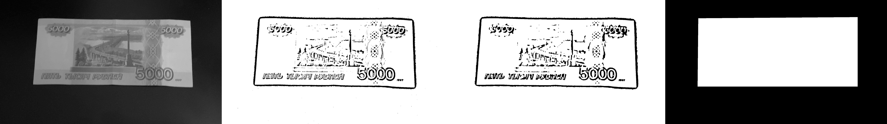
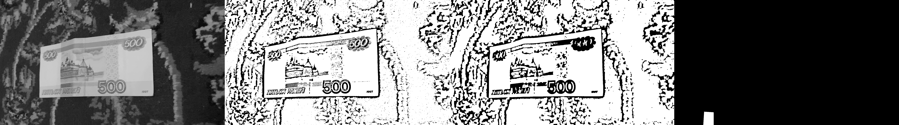

## Работа 4. Детектирование области документа на кадрах видео
автор: Плохотнюк А. Д.
дата: 2022-03-21T11:24:08

url: https://github.com/Gorgeousanya/ImageProcessing

### Задание
0. текст, иллюстрации и подписи отчета придумываем самостоятельно
1. самостоятельно снимаем видео смартфоном
- объект съемки - купюры (рубли разного номинала), расправленные и лежащие на поверхности (проективно искаженны прямоугольник)
- количество роликов - от 5 шт.
- длительность - 5-7 сек
- условия съемки разные
2. извлекаем по 3 кадра из каждого ролика (делим кол-во кадров на 5 и берем каждый с индеком 2/5,3/5,4/5)
3. цветоредуцируем изображения
4. бинаризцем изображения
5. морфологически обрабатываем изображения
6. выделяем основную компоненту связности
7. руками изготавливаем маски (идеальная зона купюры)
8. оцениваем качество выделение зоны и анализируем ошибки
### Результаты


Рис. 1. Исходные тестовые изображения


Рис. 2. Визуализация результата цветоредукции, бинаризаии, морфологической обработки и маски с выделенной компонентой связности для первого кадра первого видео


Рис. 3. Визуализация результата цветоредукции, бинаризаии, морфологической обработки и маски с выделенной компонентой связности для третьего кадра пятого видео


Рис. 4. Визуализация сравнения масок на цветоредуцированных изображениях, где красным выделена программная маска, а синим - маска, изготовленная руками

Результаты сравнения качества для 1 видео 1 кадра: 0.939419

Результаты сравнения качества для 1 видео 2 кадра: 0.938739

Результаты сравнения качества для 1 видео 3 кадра: 0.942526

Результаты сравнения качества для 2 видео 1 кадра: 0.883271

Результаты сравнения качества для 2 видео 2 кадра: 0.919413

Результаты сравнения качества для 2 видео 3 кадра: 0.786306

Результаты сравнения качества для 3 видео 1 кадра: 0.923092

Результаты сравнения качества для 3 видео 2 кадра: 0.790186

Результаты сравнения качества для 3 видео 3 кадра: 0.887582

Результаты сравнения качества для 4 видео 1 кадра: 0.915543

Результаты сравнения качества для 4 видео 2 кадра: 0.931379

Результаты сравнения качества для 4 видео 3 кадра: 0.955688

Результаты сравнения качества для 5 видео 1 кадра: 0.0186173

Результаты сравнения качества для 5 видео 2 кадра: 0.000117229

Результаты сравнения качества для 5 видео 3 кадра: 0

### Вывод
В среднем, площади масок отличаются не более чем на 20%, кроме тех, что на последнем видео, поскольку программе не удалось определить корректные компоненты связности из-за неоднородного фона


### Текст программы

```cpp
#include <opencv2/opencv.hpp>

void frame(cv::VideoCapture cap, int index) {
    long length = cap.get(cv::CAP_PROP_FRAME_COUNT);
    cv::Mat image1, image2, image3, image;
    for (int i=0; i<length; i++){
        if (i == long((length*2)/5)){
            cap>>image1;
            cv::imwrite("lab04_"+std::to_string(index)+"_"+std::to_string(1)+".png", image1);
        } else
        if (i == long((length*3)/5)) {
            cap>>image2;
            cv::imwrite("lab04_"+std::to_string(index)+"_"+std::to_string(2)+".png", image2);
        } else
        if (i == long((length*4)/5)) {
            cap>>image3;
            cv::imwrite("lab04_"+std::to_string(index)+"_"+std::to_string(3)+".png", image3 );
        } else {
            cap>>image;
        }
    }
}

double quality(cv::Mat detected, cv::Mat correct) {
    double equal = 0., total = 0.;
    for (int i = 0; i < detected.cols; i++) {
        for (int j = 0; j < detected.rows; j++) {
            if (detected.at<uchar>(j, i) != 0 || correct.at<uchar>(j, i) != 0) {
                total++;
            }
            if (detected.at<uchar>(j, i) != 0 && correct.at<uchar>(j, i) != 0) {
                equal++;
            }
        }
    }
    return equal / total;
}

cv::Mat final(cv::Mat img, cv::Mat detected, cv::Mat cor) {
    cv::Mat rgbImage, rgbImageChannels[3];
    cv::cvtColor(img, rgbImage, cv::COLOR_GRAY2BGR);
    cv::split(rgbImage, rgbImageChannels);
    cv::max(rgbImageChannels[2], detected, rgbImageChannels[2]);
    cv::max(rgbImageChannels[0], cor, rgbImageChannels[0]);
    cv::merge(rgbImageChannels, 3,  rgbImage);
    return rgbImage;
}

void mask(cv::Mat& img, std::string filename){
    cv::FileStorage fs("..\\..\\..\\data\\correct.json", {cv::FileStorage::READ | cv::FileStorage::FORMAT_JSON});
    cv::FileNode x = fs[filename]["x"];
    cv::FileNode y = fs[filename]["y"];
    img = cv::Scalar (0);
    std::vector<cv::Point>point;
    for (int i = 0; i < x.size(); i++) {
        point.push_back(cv::Point(x[i], y[i]));
    }
    cv::fillPoly(img, point, cv::Scalar(255, 255, 255));
    cv::imwrite("mask"+filename, img);
}

void results(cv::VideoCapture cap, int index){
    std::vector<cv::Mat> img;
    frame(cap, index);
    for (int i=0; i<3; i++){
        cv::Mat src=cv::imread("..\\..\\..\\bin.dbg\\lab04_"+std::to_string(index)+"_"+std::to_string(i+1)+".png");
        img.push_back(src);
        cv::Mat gray_img, labels, stats, img_edge, centroids, img_color, bi, filt, morph, image;

        //цветоредуцирование
        cv::cvtColor(img[i], gray_img, cv::COLOR_BGR2GRAY);
        cv::imwrite("gray.png" , gray_img);

        //бинаризация
        cv::adaptiveThreshold(gray_img, bi, 255, cv::ADAPTIVE_THRESH_GAUSSIAN_C, cv::THRESH_BINARY, 71, 11);
        cv::imwrite("bi.png" , bi);

        //морфология
        cv::Mat kernel = cv::getStructuringElement(cv::MORPH_RECT, cv::Size((2 * 2) + 1,(3 * 3) + 1));
        cv::erode(bi, morph, kernel, cv::Point(-1, -1));
        cv::dilate(morph, morph, kernel);
        cv::morphologyEx(morph, morph, cv::MORPH_OPEN, cv::getStructuringElement(cv::MORPH_RECT, cv::Size(3, 3)));
        cv::morphologyEx(morph, morph, cv::MORPH_CLOSE, cv::getStructuringElement(cv::MORPH_RECT, cv::Size(3, 3)));
        cv::imwrite("morph.png" , morph);

        //фильтрация
        cv::medianBlur(morph, filt, 3);
        cv::imwrite("filter.png" , filt);

        //выделение компонент связности
        cv::connectedComponentsWithStats(filt, labels, stats, centroids);
        int max_i = 0, max_s = 0;
        for (int i = 0; i < stats.rows; i++) {
            if ((stats.at<int>(i, 4) > max_s)&&(stats.at<int>(i, 0)!=0)&&(stats.at<int>(i, 1)!=0)) {
                max_i = i;
                max_s = stats.at<int>(i, 4);
            }
        }
        int x = stats.at<int>(max_i, 0), y = stats.at<int>(max_i, 1),
        x1 = centroids.at<double>(max_i, 0), y1 = centroids.at<double>(max_i, 1),
        width = stats.at<int>(max_i, 2), height = stats.at<int>(max_i, 3);
        std::vector<cv::Point> point;
        point.push_back(cv::Point(x1-width/2.0, y1 + height/2.0));
        point.push_back(cv::Point(x, y));
        point.push_back(cv::Point(x1+width/2.0, y1 - height/2.0 ));
        point.push_back(cv::Point(x1+width/2.0, y1 + height/2.0));
        cv::Mat banknote(filt.rows, filt.cols, filt.type(), cv::Scalar(0));
        cv::fillPoly(banknote, point, cv::Scalar(255, 255, 255));
        cv::imwrite("mask"+std::to_string(index)+"_"+std::to_string(i+1)+".png", banknote);

        //закрашивание компонент связности
//        cv::Mat labelImage;
//        int nLabels = connectedComponents(filt, labelImage);
//        std::vector<cv::Vec3b> colors(nLabels);
//        colors[0] = cv::Vec3b(255, 255, 255);
//        for (int label = 1; label < nLabels; ++label)
//        {
//            colors[label] = cv::Vec3b(0, 0, 0);
//        }
//        cv::Mat dst(filt.size(), CV_8UC3);
//        for (int r = 0; r < dst.rows; ++r)
//        {
//            for (int c = 0; c < dst.cols; ++c)
//            {
//                int label =(int)labelImage.at<int>(r, c);
//                dst.at<cv::Vec3b>(r, c) = colors[label];
//            }
//        }

        // draw contours
//        std::vector<std::vector<cv::Point>> contours;
//        std::vector<cv::Vec4i> hierarchy;
//        findContours(filt, contours, hierarchy, cv::RETR_TREE, cv::CHAIN_APPROX_NONE);
//        cv::Mat image_copy = filt.clone();
//        cv::drawContours(image_copy, contours, 1, cv::Scalar(0, 255, 0), -1);

//        //шаблонная маска
        cv::Mat mask_image(filt.rows, filt.cols, filt.type(), cv::Scalar(0, 0, 0));
        mask(mask_image, "lab04_"+std::to_string(index)+"_"+std::to_string(i+1)+".png");

        //оценка результатов
        std::cout<<"Результаты сравнения качества для "<<index<<" видео "<<std::to_string(i+1)<<" кадра: "<<quality(banknote, mask_image)<<'\n';
        cv::Mat final_img;
//        cv::addWeighted(gray_img, 0.5 , img[i], 0.3, 0.0, final_img , -1);
//        cv::addWeighted(final_img, 0.5 , banknote, 0.3, 0.0, final_img , -1);
        final_img=final(gray_img, banknote, mask_image);
        cv::imwrite("final"+std::to_string(index)+"_"+std::to_string(i+1)+".png", final_img);

        //коллаж из изображений
//        image.push_back(gray_img);
//        image.push_back(bi);
//        image.push_back(morph);
//        image.push_back(banknote);
        cv::hconcat(gray_img, bi, image);
        cv::hconcat(image, morph, image);
        cv::hconcat(image, banknote, image);
        cv::imwrite("process.png", image);
    }
}

int main() {
    cv::Mat src, mask;
    for (int i=0; i<5; i++) {
        cv::VideoCapture cap("..\\..\\..\\data\\IMG_"+std::to_string(i+1)+".mov");
        results(cap, i+1);
    }
    for (int i=0; i<5; i++) {
        cv::Mat image, image_mask;
        for (int j = 0; j < 3; j++) {
            image.push_back(cv::imread(
                    "..\\..\\..\\bin.dbg\\lab04_" + std::to_string(i + 1) + "_" +
                    std::to_string(j + 1) + ".png"));
            image_mask.push_back(cv::imread(
                    "..\\..\\..\\bin.dbg\\final" + std::to_string(i + 1) + "_" +
                    std::to_string(j + 1) + ".png"));
        }
        if (!src.empty()) {
            cv::hconcat(src, image, src);
            cv::hconcat(mask, image_mask, mask);
        } else {
            src = image.clone();
            mask = image_mask.clone();
        }
    }
    cv::imwrite("src.png", src);
    cv::imwrite("result.png", mask);
    return 0;
}
```
